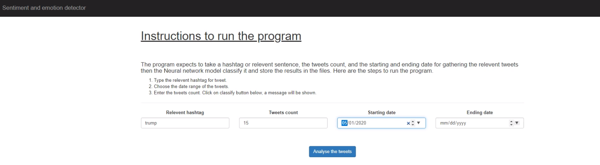

# Twitter Sentiment Analysis Web Application

This is a simple web application built using Python's Flask web framework that allows users to perform sentiment analysis on tweets related to a specific topic within a given date range. The application is built using two machine learning models - one for emotion analysis and another for sentiment analysis.

## Installation

To use this application, follow the steps below:

1. Clone this repository to your local machine using `git clone https://github.com/<username>/<repository>.git`
2. Navigate to the project directory using `cd <repository>`
3. Install the required packages using `pip install -r requirements.txt`

## Usage

1. Run the application using `python app.py` and navigate to `http://localhost:5000` in your web browser.
2. Enter a topic in the first textbox, the number of tweets to scrape in the second textbox, and the date range in the third and fourth textboxes.
3. Click the 'Submit' button to initiate the sentiment analysis.
4. The results of the analysis will be displayed on the same page in a table format, containing the probabilities of each emotion and sentiment class for the tweets.

## Training the Model

Before running the Flask application, you need to train the machine learning models on the dataset. This can be done by running the following notebooks:

- Sentimental Analysis - Part 1.ipynb
- Emotional Analysis - Part 2.ipynb

After running these notebooks, the following files will be generated and you should have them in the static folder before running the application:

- my_model.h5
- sentimentmodel.pkl
- tokenizer.pickle
- vectorizer.pickle

The dataset used in this project comes from the following resources:

- [Sentiment140](https://www.kaggle.com/kazanova/sentiment140)
- [Preprocessed Twitter Tweets](https://www.kaggle.com/shashank1558/preprocessed-twitter-tweets)
- [First GOP Debate Twitter Sentiment](https://www.kaggle.com/crowdflower/first-gop-debate-twitter-sentiment)

Once the models are trained, you can run the Flask application to perform sentiment analysis on the tweets related to a specific topic.

## Dependencies

This application requires the following dependencies:

- Flask==2.1.0
- GetOldTweets3==0.0.11
- numpy==1.19.5
- pandas==1.3.4
- scikit-learn==1.0.2
- tensorflow==2.6.0

